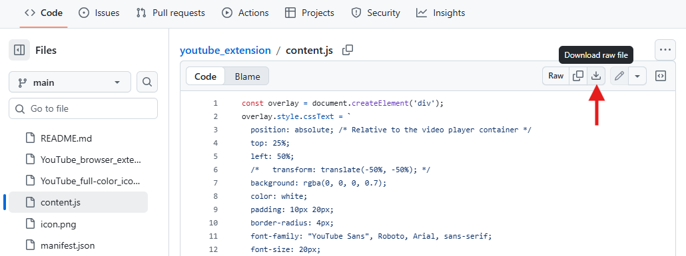

### To use this extension:

1. Download the `manifest.json`, `content.js` and `icon.png` files.
   - For each file, click on its name to see its contents and then click the *Download* button in the top right of the page that comes up.
   

2. Place the downloaded files into a new folder.
3. Go to the *extensions* page in your Chrome (chrome://extensions) or Edge (edge://extensions) browser.
4. Turn on **Developer mode** (toggle is in the top-right corner in Chrome and top-left corner in Edge).
5. Click the **Load unpacked** button near the top of the page.
&nbsp;&nbsp;&nbsp;&nbsp;

6. In the popup window, select the folder you created in **Step 1**.
